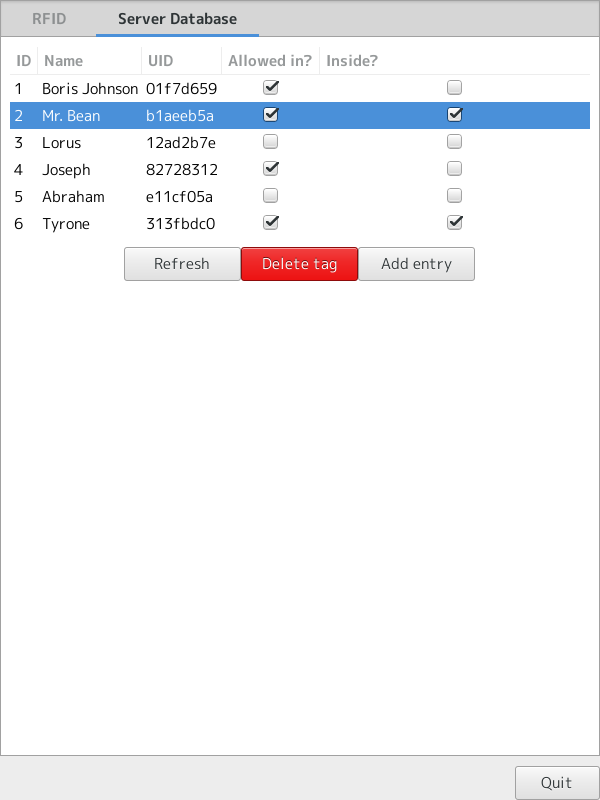
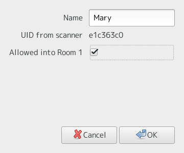

# Assured-GUI #
Python Gtk Gui frontend to the Assured suite of applications by AssuRFID.

## Dependencies ##
  * [GCC C++ compiler](http://gcc.gnu.org)
  * [Python 2.7](http://python.org)
  * [libnfc](http://github.com/nfc-tools/libnfc)
  * [Gtk 3.x](http://www.gtk.org) and [PyGObject](https://wiki.gnome.org/action/show/Projects/PyGObject)
  * [python-requests](http://python-requests.org)
  
## Instructions ##
1. Download and set up [Assured-server](http://github.com/AssuRFID/assured-server).
2. [Set up libnfc and nfc reader](http://learn.adafruit.com/adafruit-nfc-rfid-on-raspberry-pi)
3. Build NFC helper executable:

        make
4. Run the GUI like so:

		chmod +x assured-gui/assured-gui.py      # Allow executing
        ./assured-gui/assured-gui.py

## Screenshots ##

